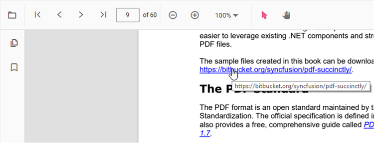

# Navigation in React Pdfviewer component

The PDF Viewer supports different internal and external navigations.

## Toolbar page navigation option

The default toolbar of PDF Viewer contains the following navigation options

* [**Go to page**](https://ej2.syncfusion.com/vue/documentation/api/pdfviewer/navigation/#gotopage):- Navigates to the specific page of a PDF document.
* [**Show next page**](https://ej2.syncfusion.com/vue/documentation/api/pdfviewer/navigation/#gotonextpage):- Navigates to the next page of PDF a document.
* [**Show previous page**](https://ej2.syncfusion.com/vue/documentation/api/pdfviewer/navigation/#gotopreviouspage):- Navigates to the previous page of a PDF document.
* [**Show first page**](https://ej2.syncfusion.com/vue/documentation/api/pdfviewer/navigation/#gotofirstpage):-  Navigates to the first page of a PDF document.
* [**Show last page**](https://ej2.syncfusion.com/vue/documentation/api/pdfviewer/navigation/#gotolastpage):- Navigates to the last page of a PDF document.

You can enable/disable page navigation option in PDF Viewer using the following code snippet.,



```ts

import * as ReactDOM from 'react-dom';
import * as React from 'react';
import { PdfViewerComponent, Toolbar, Magnification, Navigation, LinkAnnotation, BookmarkView,
         ThumbnailView, Print, TextSelection, TextSearch, Annotation, Inject } from '@syncfusion/ej2-react-pdfviewer';
import { RouteComponentProps } from 'react-router';

export class App extends React.Component<{}, {}> {
  render() {
    return (
    <div>
      <div className='control-section'>
        {/* Render the PDF Viewer */}
        <PdfViewerComponent
          id="container"
          documentPath="PDF_Succinctly.pdf"
          enableNavigation={true}
          serviceUrl="https://ej2services.syncfusion.com/production/web-services/api/pdfviewer"
          style={{ 'height': '640px' }}>

              <Inject services={[ Toolbar, Annotation, Magnification, Navigation, LinkAnnotation, BookmarkView,
                                  ThumbnailView, Print, TextSelection, TextSearch]} />
        </PdfViewerComponent>
      </div>
    </div>);
  }
}
ReactDOM.render(<App />, document.getElementById('sample'));

```



## Bookmark navigation

The Bookmarks saved in PDF files are loaded and made ready for easy navigation. You can enable/disable bookmark navigation by using the following code snippet.,



```ts

import * as ReactDOM from 'react-dom';
import * as React from 'react';
import { PdfViewerComponent, Toolbar, Magnification, Navigation, LinkAnnotation, BookmarkView,
         ThumbnailView, Print, TextSelection, TextSearch, Annotation, Inject } from '@syncfusion/ej2-react-pdfviewer';
import { RouteComponentProps } from 'react-router';

export class App extends React.Component<{}, {}> {
  render() {
    return (
    <div>
      <div className='control-section'>
        {/* Render the PDF Viewer */}
        <PdfViewerComponent
          id="container"
          documentPath="PDF_Succinctly.pdf"
          enableBookmark={true}
          serviceUrl="https://ej2services.syncfusion.com/production/web-services/api/pdfviewer"
          style={{ 'height': '640px' }}>

              <Inject services={[ Toolbar, Annotation, Magnification, Navigation, LinkAnnotation, BookmarkView,
                                  ThumbnailView, Print, TextSelection, TextSearch]} />
        </PdfViewerComponent>
      </div>
    </div>);
  }
}
ReactDOM.render(<App />, document.getElementById('sample'));

```



## Thumbnail navigation

Thumbnails is the miniature representation of actual pages in PDF files. This feature displays thumbnails of the pages and allows navigation. You can enable/disable thumbnail navigation by using the following code snippet.,



```ts

import * as ReactDOM from 'react-dom';
import * as React from 'react';
import { PdfViewerComponent, Toolbar, Magnification, Navigation, LinkAnnotation, BookmarkView,
         ThumbnailView, Print, TextSelection, TextSearch, Annotation, Inject } from '@syncfusion/ej2-react-pdfviewer';
import { RouteComponentProps } from 'react-router';

export class App extends React.Component<{}, {}> {
  render() {
    return (
    <div>
      <div className='control-section'>
        {/* Render the PDF Viewer */}
        <PdfViewerComponent
          id="container"
          documentPath="PDF_Succinctly.pdf"
          enableThumbnail={true}
          serviceUrl="https://ej2services.syncfusion.com/production/web-services/api/pdfviewer"
          style={{ 'height': '640px' }}>

              <Inject services={[ Toolbar, Annotation, Magnification, Navigation, LinkAnnotation, BookmarkView,
                                  ThumbnailView, Print, TextSelection, TextSearch]} />
        </PdfViewerComponent>
      </div>
    </div>);
  }
}
ReactDOM.render(<App />, document.getElementById('sample'));

```



## Hyperlink navigation

Hyperlink navigation features enables navigation to the URLs (website links) in a PDF file.



## Table of content navigation

Table of contents navigation allows users to navigate to different parts of a PDF file that are listed in the table of contents section.

You can enable/disable link navigation by using the following code snippet.,



```ts

import * as ReactDOM from 'react-dom';
import * as React from 'react';
import { PdfViewerComponent, Toolbar, Magnification, Navigation, LinkAnnotation, BookmarkView,
ThumbnailView, Print, TextSelection, TextSearch, Annotation, Inject } from '@syncfusion/ej2-react-pdfviewer';
import { RouteComponentProps } from 'react-router';

export class App extends React.Component<{}, {}> {
  render() {
    return ( <div>
      <div className='control-section'>
        {/* Render the PDF Viewer */}
        <PdfViewerComponent
          id="container"
          documentPath="PDF_Succinctly.pdf"
          enableHyperlink={true}
          serviceUrl="https://ej2services.syncfusion.com/production/web-services/api/pdfviewer"
          style={{ 'height': '640px' }}>

              <Inject services={[ Toolbar, Annotation, Magnification, Navigation, LinkAnnotation, BookmarkView,
                                  ThumbnailView, Print, TextSelection, TextSearch]} />
        </PdfViewerComponent>
      </div>
    </div>);
  }
}
ReactDOM.render(<App />, document.getElementById('sample'));

```


You can change the open state of the hyperlink in the PDF Viewer by using the following code snippet,



```ts

import * as ReactDOM from 'react-dom';
import * as React from 'react';
import { PdfViewerComponent, Toolbar, Magnification, Navigation, LinkAnnotation, BookmarkView,
         ThumbnailView, Print, TextSelection, TextSearch, Annotation, Inject } from '@syncfusion/ej2-react-pdfviewer';
import { RouteComponentProps } from 'react-router';

export class App extends React.Component<{}, {}> {
  render() {
    return (
    <div>
      <div className='control-section'>
        {/* Render the PDF Viewer */}
        <PdfViewerComponent
          id="container"
          documentPath="PDF_Succinctly.pdf"
          enableHyperlink="true"
          hyperlinkOpenState={NewTab}
          serviceUrl="https://ej2services.syncfusion.com/production/web-services/api/pdfviewer" style={{ 'height': '640px' }}>

              <Inject services={[ Toolbar, Annotation, Magnification, Navigation, LinkAnnotation, BookmarkView,
                                  ThumbnailView, Print, TextSelection, TextSearch]} />
        </PdfViewerComponent>
      </div>
    /div>);
  }
}
ReactDOM.render(<App />, document.getElementById('sample'));

```



## See also

* [Toolbar items](./toolbar)
* [Feature Modules](./feature-module)