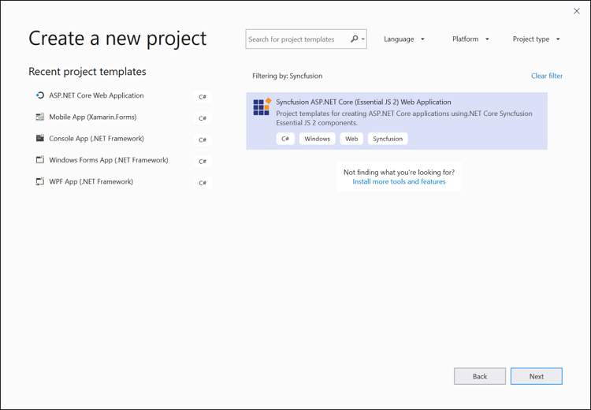
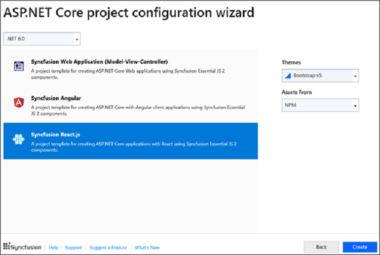

# Create project 

## Create project

Syncfusion provides the **Visual Studio Project Templates** for creating the Syncfusion React Application. The Syncfusion React application creates the application with the required Syncfusion references, namespaces and CDN links for making the development earlier with the Syncfusion components.

> The Syncfusion React project templates are available from v17.1.0.47.

The following steps help you to create the Syncfusion React Application through the Visual Studio:
1. Open the Visual Studio 2017 or later.
2. To create a Syncfusion React project, follow either one of the options below:

    **Option 1:**

     Choose the **Extension->Syncfusion-> Essential Studio for ASP.NET Core -> Create New Syncfusion Project… in the Visual Studio menu.**

    

    > In Visual Studio 2017, you can see the **Syncfusion** menu directly in the Visual Studio menu.

    **Option 2:**

     Choose **File > New > Project** in Visual Studio. The Create a new project dialog opens. You can get the Syncfusion provided templates by filtering the Project type with Syncfusion or use the **Search option** with the key word of **Syncfusion.**

    

    > In Visual Studio 2017, choose **File > New > Project** and navigate to **Syncfusion > .NET Core > Syncfusion ASP.NET Core (Essential JS 2) Web Application** in **Visual Studio**.

3. Select the **Syncfusion ASP.NET Core Web Application** and choose the Next button.

    

4. Name the **Project**, choose the destination location and then click **Create** button. The **Syncfusion ASP.NET Core**  project configuration wizard appears.

    

    Choose the **Syncfusion React.js** template and choose required theme and asset.

5. Click the Create button, the Syncfusion React application has been created.

6. The created Syncfusion React application configured with Syncfusion.

7. The required Syncfusion React NPM packages, scripts and selected style configured with the application.